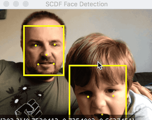

# MTCNN Face Detection for Java, using Tensorflow and ND4J

[  ](https://bintray.com/big-data/maven/mtcnn-java/_latestVersion)

> Note: This is still Work In Progress!



Java and Tensorflow implementation of the [MTCNN Face Detector](https://arxiv.org/abs/1604.02878). It is based on David Sandberg's [FaceNet's MTCNN](https://github.com/davidsandberg/facenet/tree/master/src/align) 
python implementation and the original [Zhang, K et al. (2016) ZHANG2016](https://arxiv.org/abs/1604.02878) paper and related [Matlab implementation](https://github.com/kpzhang93/MTCNN_face_detection_alignment).

It reuses the `PNet`, `RNet` and `ONet` Tensorflow models created in [FaceNet's MTCNN](https://github.com/davidsandberg/facenet/tree/master/src/align) project and 
initialized with the original pre-trained [weights](https://github.com/kpzhang93/MTCNN_face_detection_alignment/tree/master/code/codes/MTCNNv2/model). Find [here](https://github.com/davidsandberg/facenet/pull/866) 
how to freeze those models.

> Note that all necessary Tensorflow models are already pre-bundled with this project! No need to download or freeze those by yourself.

The MTCNN requires a lot of linear algebra computations such as multi-dimensional array computation. Therefore the [ND4J](https://deeplearning4j.org/docs/latest/nd4j-overview) library is used for implementing the 
 processing steps that connect the `PNet`, `RNet` and `ONet` Tensorflow networks. Furthermore the [JavaCV](https://github.com/bytedeco/javacv) is leverage for image manipulation and the ND4J-Tensorflow's GraphRunner is used to 
 inferring the pre-trained tensorflow models. Later allows to share the ND4J and JavaCV intermediate processing states directly with the tensorflow runner, off-heap without need of additional serialization/deserialization.        

## Quick Start

Following snipped shows how to use the service to obtain face bounding box annotations as json string as well as 
how to augment the input image with the detected face annotations.

```java
MtcnnService mtcnnService = new MtcnnService(30, 0.709, new double[] { 0.6, 0.7, 0.7 });
Java2DNativeImageLoader imageLoader = new Java2DNativeImageLoader();
ObjectMapper jsonMapper = new ObjectMapper().enable(SerializationFeature.INDENT_OUTPUT);

String inputImageUri = "classpath:/pivotal-ipo-nyse.jpg";
try (InputStream imageInputStream = new DefaultResourceLoader().getResource(inputImageUri).getInputStream()) {
    INDArray image = imageLoader.asMatrix(imageInputStream).get(point(0), all(), all(), all()).dup();
    FaceAnnotation[] faceAnnotations = mtcnnService.faceDetection(image);
    System.out.println("Face Annotations (JSON): " + jsonMapper.writeValueAsString(faceAnnotations));
    BufferedImage faceAnnotatedImage = MtcnnUtil.drawFaceAnnotations(imageLoader.asBufferedImage(image), faceAnnotations);
    ImageIO.write(faceAnnotatedImage, "png", new File("./AnnotatedImage.png"));
}

```
The snipped takes the input image like this:


and json face annotation response like this:

```json
[ {
  "bbox" : { "x" : 331, "y" : 92, "w" : 58, "h" : 71 }, "confidence" : 0.9999871253967285,
  "landmarks" : [ {
    "type" : "LEFT_EYE", "position" : { "x" : 346, "y" : 120 } }, {
    "type" : "RIGHT_EYE", "position" : { "x" : 374, "y" : 119 } }, {
    "type" : "NOSE", "position" : { "x" : 359, "y" : 133 } }, {
    "type" : "MOUTH_LEFT", "position" : { "x" : 347, "y" : 147 } }, {
    "type" : "MOUTH_RIGHT", "position" : { "x" : 371, "y" : 147 },
  } ]
}, {
  "bbox" : ... 
```

## Maven setup

Use the following dependency to add the `mtcnn` utility to your project 
```xml
<dependency>
  <groupId>net.tzolov.cv</groupId>
  <artifactId>mtcnn</artifactId>
  <version>0.0.3</version>
</dependency>
```
You may also need to add the following maven repository to your pom:
```xml
<repositories>
    <repository>
        <snapshots>
            <enabled>false</enabled>
        </snapshots>
        <id>bintray-big-data-maven</id>
        <name>bintray</name>
        <url>https://dl.bintray.com/big-data/maven</url>
    </repository>
</repositories>
```

## Benchmar
Use this [MtcnnServiceBenchmark](https://github.com/tzolov/mtcnn-java/blob/master/src/test/java/net/tzolov/cv/mtcnn/beanchmark/MtcnnServiceBenchmark.java) to perform some basic benchmarking. You can change the image URI to test
the performance with different images.   
